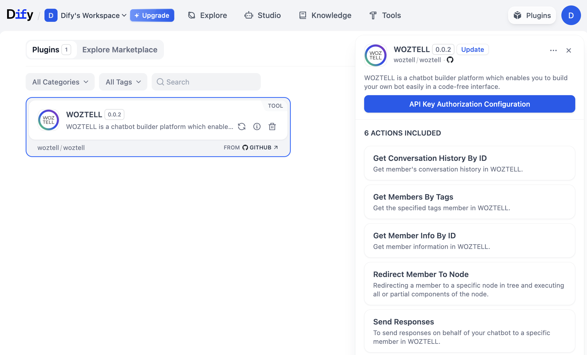

# WOZTELL

## Overview

WOZTELL is your all-in-one platform to seamlessly create, manage, and deploy chatbots across WhatsApp, Messenger, Instagram, and Websites.

In the dify workflow, you can use the **WOZTELL tool** to send messages to members.

## Configuration

### Sign up WOZTELL and WhatsApp Business API for Free

You can now create a WOZTELL account and open up a WhatsApp Business API account, completely for free.

1.  Go to the registration link: https://platform.woztell.com/signup?lang=en

2.  Fill in personal and company details and verify your email.

    

    

3.  Once you signed up, you will be directed to the platform homepage. There, you can register a WhatsApp Business API account for free following [https://doc.woztell.com/docs/procedures/basic-whatsapp-chatbot-setup/standard-procedures-wa-connect-waba/](https://doc.woztell.com/docs/procedures/basic-whatsapp-chatbot-setup/standard-procedures-wa-connect-waba/) or use the buttons on the top right of the homepage to chat with our sales team or book a demo session.

    

### Get WOZTELL tools

### Fill in the configuration in Dify

On the Dify navigation page, click `Tools > WOZTELL > Authorize` and fill in the Access Token.

1.  Login your WOZTELL account and open [**https://platform.woztell.com/settings/accesstokens?lang=en**](https://platform.woztell.com/settings/accesstokens?lang=en), and enable the **channel:list**, **botapi:sendResponses**, and **bot:redirectMemberToNode** permissions.

2.  For more functions you need, please check the document [**https://doc.woztell.com/docs/documentations/settings/access-token/**](https://doc.woztell.com/docs/documentations/settings/access-token/)

3.  Generate the access token

    

4.  Fill in access token and **Save**

    

### Using the tool

You can use the WOZTELL tool in the following application types:

#### Chatflow / Workflow applications

Both Chatflow and Workflow applications support adding a WOZTELL tool node.

