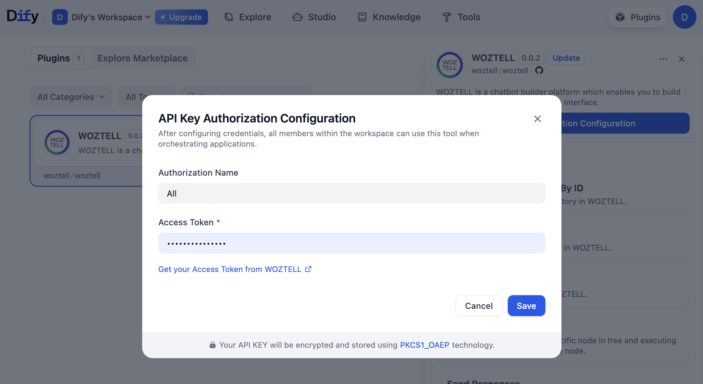

# WOZTELL

## Overview

WOZTELL is your all-in-one platform to seamlessly create, manage, and deploy chatbots across WhatsApp, Messenger, Instagram, and Websites.

In the dify workflow, you can use the **WOZTELL tool** to send messages to members.

## Configuration

### Sign up WOZTELL and WhatsApp Business API for Free

You can now create a WOZTELL account and open up a WhatsApp Business API account, completely for free.

1. Go to the registration link: <https://platform.woztell.com/signup?lang=en&partner=DIFY>

2. Fill in personal and company details and verify your email.

    

    

3. Once you signed up, you will be directed to the platform homepage. There, you can register a WhatsApp Business API account for free following [https://doc.woztell.com/docs/procedures/basic-whatsapp-chatbot-setup/standard-procedures-wa-connect-waba/](https://doc.woztell.com/docs/procedures/basic-whatsapp-chatbot-setup/standard-procedures-wa-connect-waba/) or use the buttons on the top right of the homepage to chat with our sales team or book a demo session.

    

### Fill in the configuration in Dify

Before you begin using our Dify plugin, you will need to obtain your API Credential information from the WOZTELL Platform. These credentials serve as the essential authentication keys for accessing the WOZTELL Product API. Please refer to the documentation linked below to acquire the appropriate credential according to the required permission level, and then enter this information into the WOZTELL Dify Credential configuration.

On the Dify navigation page, click `Tools > WOZTELL > Authorize` and fill in the Access Token.

1. Login your WOZTELL account and open [**https://platform.woztell.com/settings/accesstokens?lang=en**](https://platform.woztell.com/settings/accesstokens?lang=en), and enable the **channel:list**, **botapi:sendResponses**, and **bot:redirectMemberToNode** permissions.

2. For more functions you need, please check the document [**https://doc.woztell.com/docs/documentations/settings/access-token/**](https://doc.woztell.com/docs/documentations/settings/access-token/)

3. Generate the access token

    

4. Fill in access token and **Save**

    

### Using the tool

You can use the WOZTELL tool in the following application types:

#### Chatflow / Workflow applications

Both Chatflow and Workflow applications support adding a WOZTELL tool node.

#### Create workflow

#### Search WOZTELL

Within this list, you will find all nodes developed by WOZTELL for Dify. You may directly drag and drop the required node into the workflow designer to make it part of your workflow.

BOT API Tools: These nodes provide your workflow with the ability to send messages and perform data operations through WOZTELL products.

Member Tools: These nodes allow you to efficiently manage all member information stored within WOZTELL products.

#### Node: Send Response

Using the **Send Response** node, you can directly send messages from your WhatsApp Business number to the target customer’s WhatsApp account via the WOZTELL BotAPI. All message content can be placed directly within the Response data.

Once the message is sent, you will receive the corresponding API result, which allows subsequent nodes to continue processing the data.

For more details, please refer to the official WOZTELL product documentation: [https://doc.woztell.com/docs/reference/bot-api-reference#send-responses](https://doc.woztell.com/docs/reference/bot-api-reference#send-responses)

#### Node: Redirect member to node

With the **Redirect Member to Node** node, you no longer need to manually construct complex JSON data for sending messages. Instead, you simply pass the relevant WOZTELL information to a **Chatbot Tree** node, and the WOZTELL Chatbot will handle the subsequent actions for you — such as sending WhatsApp conversation message templates.

This node can be understood as a memory pointer: it redirects the current operation to the WOZTELL Chatbot. You do not need to prepare complicated data structures; you only need to initiate a request to the BotAPI.

For customers who already have chatbot designs running on the WOZTELL platform, this provides an excellent way to integrate with Dify.

Learn more from: [https://doc.woztell.com/docs/reference/bot-api-reference#redirect-member-to-node](https://doc.woztell.com/docs/reference/bot-api-reference#redirect-member-to-node)

## Contact

We sincerely appreciate your strong support and understanding of our current Dify plugin. If you are interested in learning more about our products or services, you may also reach us through the following channels:

* WOZTELL product team: [https://woztell.com](https://woztell.com)
* Sanuker service team: [https://sanuker.com](https://sanuker.com)
* Email: [presales@woztell.com](presales@woztell.com)
* WOZTELL WhatsApp: [https://api.whatsapp.com/send/?phone=+16506145421&text=I%20want%20to%20try%20DIFY%20and%20WOZTELL](https://api.whatsapp.com/send/?phone=+16506145421&text=I%20want%20to%20try%20DIFY%20and%20WOZTELL)

## About Us

**Sanuker**

Sanuker is a leading AI Business Messaging Consulting firm, offering professional business messaging services and AI chatbot solutions tailored for enterprises. We distinguish ourselves in the market through our innovative approach to messaging designs and strategies, especially across Meta platforms - WhatsApp, Messenger, Instagram.

As a trusted partners of AWS, HSBC Business Go, and Meta, we serve 10K+ clients across 25 countries through our WOZTELL Conversational Platform, empowering businesses to qualify leads and boost conversions.

**WOZTELL**

WOZTELL is your all-in-one platform to seamlessly create, manage, and deploy chatbots across WhatsApp, Messenger, Instagram, and Websites. Powered by cutting-edge GenAI engines, WOZTELL empowers you to execute personalized broadcasts, manage unlimited live chat agents, and integrate effortlessly with any third-party software via our robust OpenAPI.

## Resources

* WOZTELL Platform documentation, [https://doc.woztell.com/](https://doc.woztell.com/)
* WOZTELL Bot API, [https://doc.woztell.com/docs/reference/bot-api-reference](https://doc.woztell.com/docs/reference/bot-api-reference)
* WOZTELL Open API, [https://doc.woztell.com/open-api-reference](https://doc.woztell.com/open-api-reference)
* WOZTELL Webhook, [https://doc.woztell.com/docs/documentations/channels/channels-webhook](https://doc.woztell.com/docs/documentations/channels/channels-webhook)
* WhatsApp Integration on Woztell: [https://doc.woztell.com/docs/integrations/whatsapp/wa-overview](https://doc.woztell.com/docs/integrations/whatsapp/wa-overview)
* Facebook Messenger Integration on WOZTELL: [https://doc.woztell.com/docs/integrations/facebook/fb-overview](https://doc.woztell.com/docs/integrations/facebook/fb-overview)
* Instagram Integration on WOZTELL: [https://doc.woztell.com/docs/integrations/instagram/ig-overview](https://doc.woztell.com/docs/integrations/instagram/ig-overview)
* Webchat Integration on WOZTELL: [https://doc.woztell.com/docs/integrations/web-chat/webchat-overview](https://doc.woztell.com/docs/integrations/web-chat/webchat-overview)
